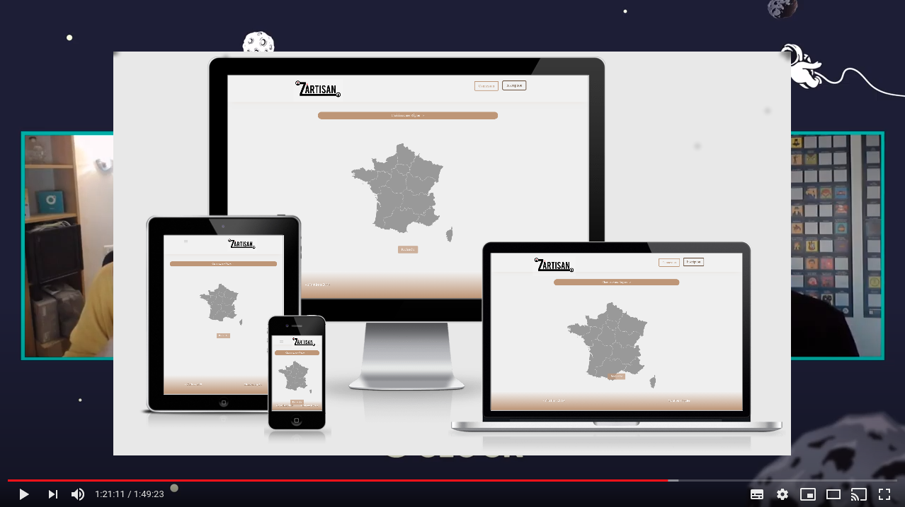

# zartisanV1

      

# End of study project at O'clock
## Site of contact between private individual and artisan

**Mobile first project.** 
**The registration of professionals is automated from 2 APIs (sirene and insee).**

#### &middot; Live View : https://zartisan.yj.fr

#### &middot; Presentation of the project (Apotheosis demo video [O'clock](https://oclock.io/) Vortex 12/20/2019)

__SCRUM methodology :__ 4 sprints.

### Technology Front-End

* React
* React-Router
* React-Helmet
* Redux
* Ant Design
* Axios

### Technology Back-End

* Symfony 4.3
* composer
* Bundle Easyadmin
* Bundle NelmioCorsBundle
* Bundle NelmioAlice
* Jwt Token
* API sirène
* API nomenclatures
* Swift Mailer

### Features in V1

* Default image for new  user.
* Creation folder and files images per user.
* Checking email and status for login.